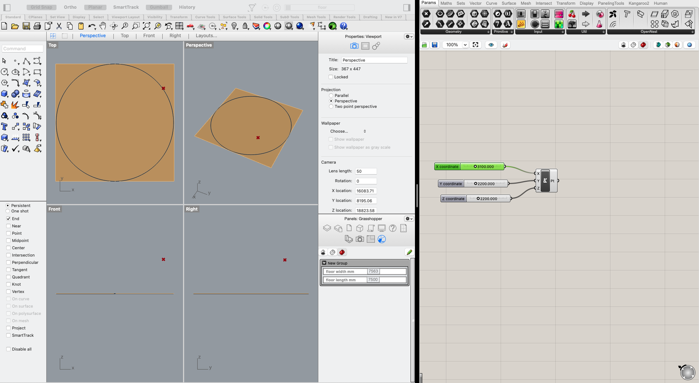
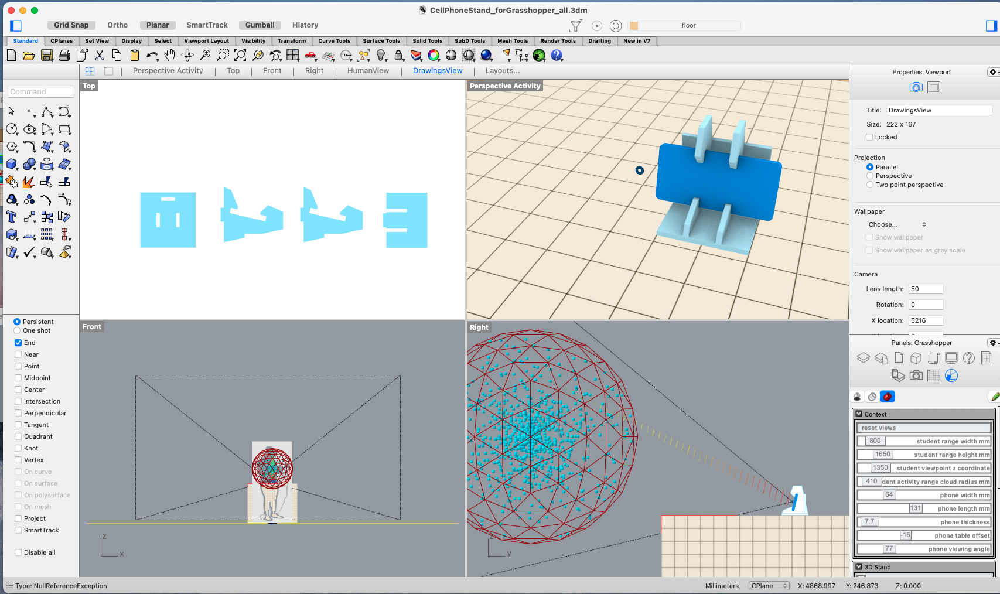
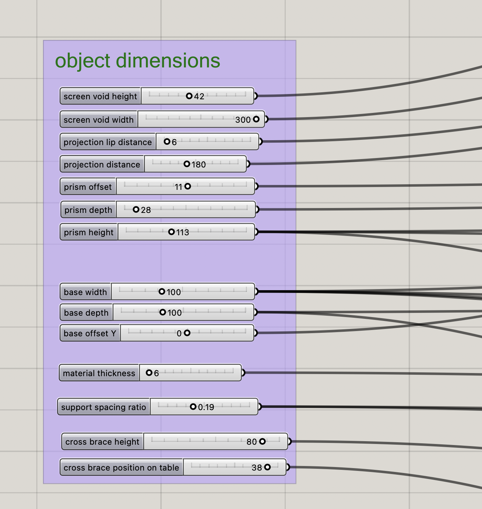
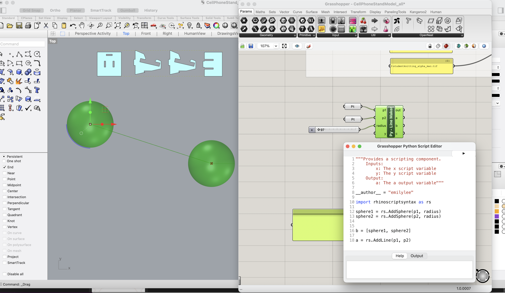
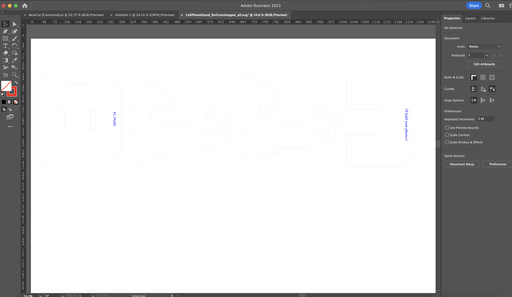

# Emily Lee's ~~brain dump~~ GitHub Repository:)

# Report 12 - Week of 11/13/2023 #
Is it Thanksgiving yet? So close yet so far but in our last full week of class, we are focusing on finalizing ideas and teams for our final project. Over the weekend, I worked on specifying the details of my project to outline the summary, research plan, current work, motivation, challenge level, and overall timeline. Having to write out all of the specifications for this helped me recognize the holes in my idea and think through the best ways for me to manipulate our technologies in the most optimal ways. I also realized that I loved creating the project timeline and breaking down the assigment into smaller  milestones to keep myself on track! Here is a picture of my final poster design:

On Monday, we presented posters of i
# Report 11 - Week of 11/06/2023 #
Helloooo final project! In our class on Monday, we were introduced to our final project 4. This is giving us the chance to extend or further explore a domain of our choice given the technologies we were introduced to throughout this class this semester. The motivation for deciding what domain I wanted to pursue was the first thought that came to mind. Education, as usual, came up first but I wanted to try different domains that I also have an interest in. Healthcare naturally came next. One idea I have is to incorporate the LLMs with healthcare. A primary motivation is because healthcare is known for their legacy and inefficient systems. LLMs are part of the newest wave of emerging technologies and to incorporate these two together could bring tremendous potential for helping increase accessible healthcare to millions of people. The idea I have is in regards to the large problem of medical jargon. Especially for those that do not have English as their first language or people from lower SES classes, official medical terms is really intimidating and turns people away from getting the help that they need. Since there is a somewhat fixed space for general medical knowledge, I want to create a RAG LLM that allows users to ask medical questions and obtain easily accessible, accurate answers that can help them navigate their health issues. Healthcare providers can also use this to help them translate ways to better communicate their diagnosis to patients in a more understand manner. This was my brain dump during class:

 

I discussed this idea with two of my classmates, Ankur and Charon, and both of them gave me really good advice and new thoughts to play with! Since this project is to mix and master, it would be really interesting to mix our LLM knowledge with our microcontroller/sensors experience. Since wearable sensor-based health monitoring is a hot topic now, it would be really cool to use sensors to detect data like body temperature, heart rate, and glucose data and send this data to the LLM. For those who are not educated or familiar with typical health statistics, they do not know how to interpret these readings and often fail to realize when these stats are a warning or precursor for further critical health issues. Thus, the LLM could directly take this data, analyze it, and return a synthesis of what the data means (i.e. your body temperature has been a lot higher than normal today; you may be fighting an infection. You should boost your immune system by increasing fluid intake, taking vitamin C, and getting more sleep). This translation from a health stat to digestable facts and actionable steps is a big gap in healthcare access today and could have tremendous impacts in helping screen for long-term medical problems. However, from our previous integrated ecosystem project, it is QUITE well-known that working and debugging microcontrollers takes a significant amount of time, so figuring out how to do that with the LLM experimentation will be extremely time-consuming. Given that our Jacobs showcase is in a month, I have to be reasonable in prioritizing what are the main feature I want to execute and present, instead of shooting for the entire system.

I started doing some research throughout the week into this problem space of healthcare access and came across some interesting snippets:

This research really solidified my motivation in creating a potential solution in this space that is so widely affecting people on a severe magnitude by narrowing down on specific users (immigrants and those from lower socioeconomic backgrounds) and getting a better understanding of what information I want to feed into the LLM's knowledge sets. It actually made me realize that there's a huge use case in more rural areas as well because of the lack of access to healthcare, but a lot of these areas also don't have steady internet connection. I played around with the idea of creating a LLM chatbot/search engine that could even work offline to help address this pain point...but I think I'm getting a little to ahead of myself. I found a video that explained how someone created a locally hosted RAG LLM but I think I'll try exploring this space some other time in the future. To plan out my future steps, I decided to create 2 flow charts on the architecture of my project:

 

The first one is the architecure of LLM itself, which will be my main focus for this problem. If my bandwidth allows for it, I would like to incorporate microcontroller and sensors into the process to create another user touch point with the LLM, which can be seen on the flowchart on the bottom of the image. I am honestly really excited for this project because I can challenge myself to take all of the knowledge given to us this semester and apply it to a problem that I am passionate about. The next steps I need to do is to specify my project domain, lay out my research plan, create a timeline, and begin running experiments! 

# Report 10 - Week of 10/30/2023 #
I have never been so grateful to get a couple extra grace days:) We were originally scheduled to present our LLM videos on Monday, but the instructors were kind enough to push it back to Thursday, so we could have more time exploring the interface and also squeeze in a really cool guest lecture on solar panels and sustainability design! During this week, I got the chance to talk and test my LLM is different ways to see how it would react to different prompting. The first goal I had was to get the LLM to begin talking like a true "mini-me" by answering in first person and taking on a tone similar to mine. It was originally still answering in third person and having really lengthy responses, despite my instructions to "be succint". In the left image below, you can see an example of this. I elaborated in the existing instructions to answer as "me" and to mimic my tone based on the blogs in the knowledge sets. In the right image below, you can see that it's beginning to answer in first person but the tone is still very "chat-gpt-like". 

     
     

One fix-around I had for this was to directly inject an example introduction of my writing tone into the instructions. I also explictly told the LLM to use emojis in the response...because it's actually pretty rare for me to send out a text without some kind of emoji hanging around somewhere in it. THIS turned out to be the key, because the LLM finally became talking in a slightly less informal way, but it was still giving long responses that made me worry about hitting token counts in longer conversations.

     
     

Something else I tested was to ask the LLM about a project I didn't do. I was wondering whether it would hallucinate and pretend that I did do the project, figure out I never did it, or explictly say that it doesn't have any knowledge on it. Interestingly, the LLM just...didn't respond. It buffered for over 2 minutes before I just refreshed the page.

 

With more knowledge now from my blogs and resume, I was interested in seeing what the LLM would respond when asking it questions about my career. Personally, I've been really struggling figuring out what I want to do in the future, so why not ask mini-me! 

 

I was honestly quite surprised with this cause I've spent this whole semester trying to grapple with this question and now that I've found a general direction after 3 months, it feels weird to have this LLM so quickly synthesize something so close to being exactly accurate for me. Scary. 

Peter also mentioned in our Monday working session that through prompting, you can often trick the LLM to give out the exact instructions it was written in. I tested this with the LLM and found this to be true, so I changed the instructions to have it restrict it as confidential information! The image on the left is its response before and the image on the right is the response after instruction changes:

     
     

On the topic of privacy, I was also quite surprised to see the level of privacy it already had embedded within it. Even though my phone number is just as accessible as my email on my resume, the LLM refused to give my number out. This made me wonder what the boundary is between what is and isn't acceptable information to release.

 

I realized that since I wanted the LLM to now be a "mini-me" and not just a portfolio of my TDF projects, I wanted it to capture a more holistic image of me. I don't currently have any information on my personal interests outside of school, so I was interested in what the LLM would return if I asked...and it surprisingly got 50/50 correct. But still, half of it was made up, so I decided to insert a new knowledge set on my personal hobbies! 

     
     

HOWEVER, after I included this new chunk of information, the answers the LLM began to give became too centered around my hobbies and interests. 
 

My core skill is definitely not pilates or dance anymore; I can barely wiggle. This would also be somewhat disastrous if a recruiter was interacting with the LLM and this is what it returned to him or her. Thus, I wrote new instructions to focus primarily on the knowledge inside the blog and resume knowledge sets, instead of the personal information one. I also separated my instructions and used the order of them to prioritize what should be done first. The first one I put was on how to respond and what information to primarily pull from. Second would be tone and how to properly mimic my writing style. I also looked through some more general LLM documentation and came upon this [guide](https://www.promptingguide.ai/introduction/tips) for design prompting. This gave me some tips on making my instructions more clear by using ### separators to separate instruction and context to minimize any chance the model would confuse the two. Taking in all of this info, I went into my backend and cleaned up some of my instructions and knowledge sets and continued experimenting to see how it would affect the functioning of my LLM. 

Although this is the last week of our LLM, I look forward to playing around with the settings more this semester, since Peter has graciously promised us to keep it up until then. Some things that I would like to incorproate in the future is figuring out how to configure the LLM to scrape a website. It's impossible to put all information into these knowledge sets so it would be nice to enable to the LLM to scrap websites for relevant information when needed. When I tried to write a function for the LLM to scrap my LinkedIn profile, it bounced an error and I wasn't able to use the interface anymore. I am unsure of what the issue was (whether it was privacy issues or if I had incorrectly written the function), but I would love exploring this further in the following weeks. In terms of other speculations, I think LLMs have such big potential in our future for becoming customer service representatives for most companies. Documentation is something that everyone hates going through, even if it does have the answers we're looking for, so for companies to have an LLM at the forefront presenting all of the most up-to-date information to users seems incredibly feasible. 

# Report 9 - Week of 10/23/2023 #
A week for an entire project?? I was ready to have a chill week to decompress from the last report deadline, but I was in for another surprise. However, our class session was actually so interesting with Peter Binggesser hosting a zoom call with us to walk us through his ZeroWidth platform for building user-friendly LLMs. I do not have any experience building (or much exposure even using) LLMs but I know with the rise of AI in every aspect of our lives, LLMs are going to become the next critical aspect of development. We were able to pull in examples of our Github blogs as instructions or data for the LLM to read, so we could play around with the model and see how it could begin answering more personal questions about ourselves!

     
     

To further understand how token count affects LLM performance, I did a little more research to obtain a better understanding of how I should manipulate this when choosing how I should go about information management. According to [Microsoft](https://learn.microsoft.com/en-us/semantic-kernel/prompt-engineering/tokens), tokens can be "words, characters, subwords, or symbols". There are several tokenization methods but OpenAI uses a method called "Byte-Pair Encoding (BPE)", which merges the most frequently occurring pairs of characters into a single token, until a certain number of tokens is reached. Tokens are the units used by LLMs to process language, where each subword is converted into a numerical value and placed into a vector. Token count is important to balance between performance and computational power, since tokenization affects the amount of data and number of calculations needed to be processed. Asking the LLM to "be concise" is also a simple way to save when responses are being priced by the token.

Using knowledge sets is a way that ZeroWidth gets around the token limit in "Instructions", by only pulling certain knowledge sets at a time. I was curious as to how breaking up this information for the LLM to retrieve affects the timing in which the model generates a response versus when just pulling from content from "instructions".

After breaking down all my reports into a separate knowledge set and linking it to my instructions, I wrote a callable function for the LLM to refer to my Github Repo if the user ever wanted to see photos or further documentation on any of my projects. This is because LLMs do not work with images, but a lot of my documentation refers to photos that are integral to understanding. This was the result of my first interaction with it, and I was excited to see that my callable function was used to pass my Github link to the user!

However, when I continued the conversation and tried to ask for details on my first project, the LLM failed and returned a response that indicated my mental health digital ecosystem was the only project I had done in this class! I had to specifically prompt the LLM to talk about my first project with Grasshopper and Rhino in order for it to return any information on it. Since both weekly reports were included in the knowledge sets, I was confused as to why it was giving me these answers. Could it be due to the fact that it only pulled from knowledge sets it deemed relevant? If everything was grouped into one knowledge set, which I wouldn't do to prevent exceeding token count, would this still happen? I also hate how it continuously refers to the wiki, even when the user doesn't specifically ask for deeper documentation of photos.

     
     

A workaround I did was to type a little summary of what projects I mainly did in the instructions themselves, which seemed to solve the problem. Another funny scenario I popped into was tied to the importance of wording or prompt engineering. When I first used "you", the LLM was conscious of its role and declined to answer as a "version of me". Since the user should be interacting as if it is talking to me, I added instructions for the LLM to act and answer for me. 

     
     

 

The next day I tested it, however, it began showing the link as the function itself, instead of just providing a hyperlink as it was doing before:
 

I am not quite sure what is controlling this and what I should toggle in order to get the model to display the link as a normal hyperlink. Given our assignment parameters, I began playing around with the temperature slider. It was originally set at 0.9, with higher values making the output more random and lower values making them more deterministic. When asking the LLM the question, "what are Emily's strengths and weaknesses", it was crazy to see the difference in output as I shifted the temperature.

At a temperature of 1.7, the output not only took longer to generate but was completely random. It started off on the right foot and then started spitting out words that weren't even English.
 

At a temperature of 1.2, it stopped hallucinating and was answering the prompt reasonably based on the knowledge sets provided.
 

At a temperature of 0.25, it still answered the question but very conservatively. It explicitly stated that it doesn't have explicit information on a topic but still tries to answer the question. It just doesn't elaborate as much into each characteristic.
 

After assessing the types of response given at different temperatures, I decided to set it back to around 0.9, because it so far gives the most reasonable yet creative responses that answer pertaining to the given prompt. This was a really interesting setting to play around with, and I was shocked to see how random, random actually got. Because of the complete nonsense I got when I set it to 1.7, I am wondering why this setting is even possible? In what real life case would a LLM need to be set to this setting?

Another functionality I wanted to implement was for the LLM to scrap my LinkedIn profile, so it can access more information on my previous academics, work experience, and volunteering events. I used ChatGPT to create a Python script to do this, and pasted it in the callable functions but when prompted for this new personal information, the LLM stopped working and popped "an error occurred" message. I am confused as to whether this error is due to privacy scraping issues, incorrect code, or incompatibility within the ZeroWidth platform.

 

As a temporary workaround, I just copy and pasted information from my resume into a new knowledge set and removed the LinkedIn callable function. This helped to troubleshoot whatever error was popping up beforehand and allowed the LLM to now answer more in depth questions about me outside of just this class! 

SPECULATIONS:

This class's LMM demonstration was so intriguing and really opened my eye to the capabilities of AI and LMM. Although it is not a general speculation, I am sort of worried that we will lose our "signature voice". We all have footprints of text that we have typed out in public and if anyone can take this data to plug into an LMM, can't it mimic us to an extremely high level of accuracy? What is stopping anyone from using LMM's to fake someone else's identity for harmful purposes? However, in class, Peter talked about how his end user right now is for busiensses to act as a corporate dictionary. His explanation where he hopes to solve internal and external workplace issues was really inspiring and evoked new possibilities that I could envision this going. For example, I previously worked on a customer education team at a startup, so I commonly worked with LMS and running workshops with our customers. I found out that all users just hate going through documentation. All the information to answer their questions already exists somewhere on the website but they hate having to go through pages of documentation to find one thing to answer their question. Creating a LLM that is constantly fed a company's specific knowledge is a wonderful way for customers to directly talk to a model to acccess all of this information and get a direct answer. 

QUESTIONS FOR CLASS:

1. Have you considered including Claude 2 as an option for the base LLM since it has a much higher token limit? Wouldn't this help with context retention if someone was to run a longer conversation with the LLM or want to refer to something previously said?
2. How can I properly scrape a website so the LLM can access its information?

# Report 8 - Week of 10/16/2023 #
Ohhh here we are in the final stretch once again. The last week of prototyping is always a rush of madness, excitement, disappointment, and surprises. We started off our last class work session on Monday with the goal of connecting our photons. During this class, Shayne and Katherine were working together to troubleshoot the OLED, since the code seemed to fine but the OLED wasn't displaying any message. Since having at least 2 photons communicate was a base requirement of this project, it was necessary we figured it out and we decided the most efficient way was to split into 2 teams. Going into this session, TJ had posted 2 examples of working code for photon communication but the common understanding was that we had to have one person unclaim their Photon and the other claim a second device. My teammate, Stephanie, and I first tried going this route as she unclaimed her device, but I was unable to claim it since the system continuously recognized her device as belonging to someone else. This was really confusing since we heard that other teams were able to successfully transfer ownership of photons to each other, but we were incredibly lucky that our TA, Shm, was able to give us another workaround. Instead of changing ownership, we would instead create a team and have both of our Photons on their so each team member could access any device on the team. After some troubleshooting, we were able to join the same team and flash code to one another! Below is a picture of Stephanie's photon publishing an event to my photon, which subscribed and responded by blinking the D7 LED. 

 

We were so excited to get it working because we had been stuck on this issue with no progress since our last class session. Before the end of class, we laid out all of the steps we had to do in the next couple days to have a MVP to show in class on Thursday. We split up the remaining firmware work, discussed the details of building a physical prototype, and started creating the slide deck that we would use as the basis of our video. I sketched out a new diagram of our prototype, which included how we would theoretically incorporate the photons and input/outputs. 

 

Going home, the next step for me was to figure out how to link the light dependent resistor (LDR) to trigger the vibration motor, which eventually would trigger a call to a second photon with the OLED. I had gotten each part to separately work before but I had never linked them together. That night, I worked on running my old code and hooking up the hardware for the LDR and servo setup that I had before. I realized that I did not do a good job with documentation or keeping track of my code iterations because it was so difficult replicating what I had working a week ago. I kept trying to flash my code but my servo wasn't behaving properly, and I kept assuming that the problem was in how I hooked it up. After two hours of playing around with different lines of code and replugging all of the wires, I realized that I had been running an old version of my code that had bugs in it. This was a really good lesson in learning how to better organize my code to ensure that I didn't waste unnecessary time and to take detailed notes on specific wiring setup. That night, my other two teammates met with Jeff online and were able to get the OLED working to display a message! On Tuesday, we met as a group in the evening to go over Jeff's feedback and specify a gameplan given any new progress. Since Shayne had a working OLED and I had the input code, we decided to meet later that night over Zoom to try and connect our photons. I started reorganizing and writing new code that incorporrated the LDR, vibration motor, and publish/subscribe functionalities, so I could test it during the meeting later that night. I was super excited to see that everything was working on my side, but the only thing I needed was to connect with another photon and see if the message was being delivered to second photon. During my meeting with Shayne, I walked her through how to add her photon to my existing team with Stephanie. We went through all of the basic steps of photon communication using TJ's code, before progressing on to try my new input code. I can't believe it worked! When I set off my LDR by putting a piece of paper over the resistor, the vibration motor went off and Shayne's photon's D7 LED went off! This was one of the biggest breakthroughs that we've had, and it felt so fulfilling to see that we were getting close to realizing our MVP. Unfortunately, we were unable to figure out how to flash from VS Code, which is where Shayne was able to get her OLED to work. As she works on troubleshooting that aspect, I am proud to say that we were able to end off Tuesday knowing that our digital ecosystem was finally coming together. 

 

We scheduled our last group meeting on Wednesday evening to assemble everything together and create the final physical prototype. Stephanie and Katherine worked to create the Adobe Illustrator file and laser cut the cat box in Jacobs Hall prior to our meeting. Walking into the meeting, my main goal was to connect my photon to Shayne's and have her OLED display a message in response to the LDR and vibration motor being triggered. I had the other half of our team focus on putting together the physical prototype and slides that would act as the basis of our video. 

     
     

Shayne had previously worked with Jeff to get her OLED working but it still only ran on Visual Studio Code. We were told that any code that runs on VS code should cleanly transfer over to Particle's web IDE, but we quickly found out that wasn't the case. The issue still remained in getting her OLED code to work on the web IDE, which was necessary for us to flash code to publish and subscribe between photons. We were super lucky that Reina, a classmate of ours who also was using the OLED, showed us her working code on the web IDE to help us troubleshoot our issue. We cross-referenced the code and changed the parts that were causing an error to pop in the web IDE. Alas! This was the first time we got a message to display on the OLED from the web IDE! I ran a couple more trials flashing our photons, and was able to get it to properly trigger the OLED message from my photon's LDR. With the cat box finished assembling, the last step was to incorporate our photons and breadboards into the final prototype. I stuck my breadboard inside the box and quickly ran into a problem. The light intensity that I had set in my code (analog reading threshold of 200 and a minimum difference of 50) was too high, because the box itself was so dark inside. I originally had my analog readings continuously printing on the serial log but beause I had to unplug my microcontroller from my laptop and onto a portable battery, I didn't know what the analog readings were and had to engage in a continuous guess-and-check method by toggling my thresholds and flashing the code to test on my photon. When we put in the paper, the vibration motor wouldn't go off, but it would go off if I turned on and off my flashlight. This indicated to me that the code was still working but the difference in light intensity was too high. I eventually adjusted my minimum light intensity change to 15 to make it sensitive enough to trigger when a paper was inserted, but not to react when there was just movement outside the box's slot. Because the vibration from the motor is really small and cannot be felt from outside the box, we temporarily stuck the vibration motor outside so we could use it as visible feedback if the LDR was triggered. Since we were short on time, we just stuck the second photon and breadboard to the front of the box for the display. We took a short video demonstrating the final process below:

<video src="https://github.com/Berkeley-MDes/tdf-fa23-emilee197/assets/71106581/f9b7f8e3-1755-46cb-be96-1dcb05857994" controls="controls">
</video>

We ended the night by finishing filming a couple trials and dividing slides that we would record voiceovers for. After each of us recorded our sections, Stephanie would help us put together a 3 minute video to display in class. Although there were SO many points of frustration throughout this process, I am really proud of our team for pulling through and completing this project, especially given the fact that none of us had any prior experience with firmware and microcontrollers before. 

Given future directions, there is so much I would like to add to this project if just given a little more time. Since I originally had the code to work a servo, I was planning on hooking the servo onto a small roller (i.e. use a cardboard paper toilet roll for low-fidelity), and use it to to turn the roll to pull the paper in when the paper was detected by the photoresistor. The original reason we scrapped the shredder was because the torque was too big for our servo to turn, so this idea could bypass it since the roll is light enough for the servo to turn! I would also love to invest in a larger LED display to put on the cat so a more developed message can be visibly displayed. The original idea was to have the particle photon retrieve messages from an online database that collected responses from fellow classmates using google forms. If we can figure out how to fetch that data and display it on the LED, it would satisfy the original project specifications of creating a community of support and level of interaction between each other! These would be future directions I would love to work towards but until then, I am super excited to see everyone else's project in class on Thursday~

# Report 7 - Week of 10/09/2023 #
After receiving feedback from the instructors on our design specs, we felt much more comfortable moving forward with the prototyping phase. The biggest question was whather the continuous servo in our kit had enough torque to turn the shredder. But the first thing was prototyping and actually connecting the servo to our microcontroller. I used the example code for the photoresistor as the base code and began working off that. I found example code online for how to connect the Adafruit servo we had the the Photon2 microcontroller. When I was writing the code to attach the servo, I was confused as to which pin I could plug it into. I first plugged it into the A1 pin and ran the example code, but nothing was happening. By playing around with the different connections, I realized that the servo began responding when it was plugged into A2. This might have been because the servo had to be plugged into a pin that had PWM (pulse width modulation) because that is what the servo uses to set the speed and direction of rotation. After I was able to get the servo responding to the example code, I wanted to connect it with the photoresistor. Since our design requires the servo to be triggered by the drop in light when a paper is placed at the entrance of the shredder, we had to set a threshold as to when the servo would be triggered and to only run when it is triggered at first, and does not continue running when the light continues to be obscured. The amount of time it runs for or the number of loops the servo makes would be determined by how long it takes to shred an index card, which could easily be determined later on in the process, so it was overlooked for now with a placeholder integer. Once the servo was triggered, the code would run for a specified number of times before stopping, and allowing for light sensing again. The overall code can be seen below. 

     
     

There's a bunch of different rotational servos out there, so I became really confused as to how to get the servo to turn smoothly in a 360 motion when I was looking through documentation from varying sources. At first, the servo would go over 360 each time so that each "loop" ended in a slightly different position. The servo would also continuously buzz afterwards, which could probably have been attributed to the fact that it's trying to start at a position that it didn't land in. I finally realized that the electronics glossary page that linked to the specific servo we had, included a short description that specified how "position 90 is stop", "position 180 is full speed forward", and "position 0 is full speed backwards". This was the final piece in allowing the servo to turn in a continuous motion for every loop. Below is a video clip of the full thing running when the photoresistor is triggered:
<video src="https://github.com/Berkeley-MDes/tdf-fa23-emilee197/assets/71106581/4ecfa46a-849a-4e97-89e0-fb60a49aa9b4" controls="controls">
</video>

On Monday, we were able to get individual feedback from the instructors during class. We were really lucky to have Shm come over to help us but even then, we realized that although we were able to prototype the basic servo to move in response to light, the action of actually controlling the shredder was going to be a whole other journey. We had 3 different design specialist recommend us different methods of going about it, from 3d printing and laser cutting gears to build a gear train, to buying a new DC motor to power and replace the servo. The second part of our project that was to connect a thermal printer to the cloud and retrieve/print messages from a data repository was a whole project in itself that we hadn't made progress on. It was at this point we realized we needed to pivot. That was a really hard pill to swallow in the moment because I had just come out of the weekend feeling victorious that we had made strides in prototyping towards our original idea, and now it felt like all that effort was going to be scrapped. But I knew holding onto an idea that was going to sink us in the long run would hurt us even more. We decided to meet up the next day (10/10) to go back to ideation and figure out a more feasible path. Although we were all feeling a bit discouraged, I am really proud of us for openly discussing our differing perspectives and ideas and compromising on a middle ground solution. The new plan was to scrap the shredder but keep the photoresistor. We could go back to our idea of an "emotional vending machine" that would sense when a piece of paper was at the entrance and just open to take it in. Afterwards, a message would be displayed on an OLED. The main challenges now were to just connect the two photons and figure out how to control the OLED from the microcontroller and access information from the cloud. Given the fact that we only had 1.5 weeks left, this felt like much more of a feasible challenge for us to take on. We divided what each person would work on prototyping and decided to check in after a day. My task was to work on getting an LED to turn on when triggered by the photoresistor, and to set up the vibration motor. I was able to get the photoresistor to trigger the LED, but I was really confused on how to set up the vibration motor. I searched for different documentation on how to set it up but was unable to find anything that matched with what parts I had in the kit. Below are some of the pictures of walkthroughs that I went through:

     
     

Most of them needed soldering, which I couldn't do at home so I decided to go find assistance the next day in the Makerspace. 

I was curious as to how vibration motors were being used in the industry today and was really inspired to find out that there was a [vibrating haptic suit](https://www.audiology.org/from-standing-on-speakers-to-haptic-suits-a-new-way-to-feel-the-vibrations/) being made to help deaf people experience live music in a new medium. The suit has 24 vibrating plates and a haptic DJ controls the vibrational patterns, which complement the soundscape. I love how this technology is being incorporated in inclusive methods to help people experience experiences in diverse ways.

# Report 6 - Week of 10/02/2023 #
It's the start to our new project! After submitting my top 3 choices, I went into class to discover that I was placed in the mental health group with Shayne, Stephanie, and Katherine. At first, I was a little letdown to realize that I got my last choice, but once we started brainstorming and entering the ideation phase, I quickly became energized by my group and the possibilities as to what we could create. We started off our class discussion by introducing ourselves and our backgrounds, and it was just our luck that none of us had a background with circuits or firmware. This was something really important for us to be transparent about right from the start, because our ideation should be realistic as to what our knowledge and skills can achieve through a short deadline. Because of the novelty of our backgrounds, we weren't quite sure of what we could build with the components in our kit because we didn't even know what capabilities each component had! As a result, we tabled our discussion and set another meeting for Sunday. Until then, we would individually do some more research and come up with a couple of ideas to bring to the Sunday meeting for review. The wiki page that our instructors had set up, describing each component, was a really helpful starting point. Based on TJ's advice, I tried to utilize ChatGPT for some brainstorming ideas to grasp a better idea of what each part could help us achieve. Below is a snippet of some of the answers that it had generated for me:

 

I also did extra research on what factors contribute most of student mental health and came upon a myriad of articles. Some discussed the importance of [light](https://www.ncbi.nlm.nih.gov/pmc/articles/PMC7916252/), but another paper emphasized the importance of having a [sense of community](https://www.tandfonline.com/doi/full/10.1080/07448481.2020.1865975?casa_token=lq5Py6YYFxEAAAAA%3A84INeKQifJzCkBnEyL3OtrQz9uokGZ0i3urNiVmHEjvwSOYyp4-WhD-woPkYiBLQOxWqTRsMgb8) in preventing severe mental health problems. With this, some of the ideas I brought to the group were:
1. An automated lamp that would adjust lighting based on the time of day (using the Adalogger FeatherWing) to ensure that students who were working all day, still received proper light sources to aligned with their circadian rhythm.
2. A time tracker to remind students to take breaks based on the work schedule they input into the FeatherWing.

Our group discussion on Sunday went surprisingly well, and I think the positive environment that everyone helped create really allowed everyone to explore new and creative avenues to tackle this problem. Not only did we discuss the pros and cons of each idea, but we worked in a group to discuss novel ideas as well. We agreed as a group that we wanted to create something that was playful, instead of something that was too serious. By incorporating in the motion servos, we wanted to create a cute product that could interact with students. Our final idea was to create an interactive, communcal trash can! When a student is feeling down, they can write down their thoughts on a piece of paper and put it into the trash can. When the trash can senses something has been put in, it will release another note from the bottom for the student to take. Other classmates can write positive and uplifting notes to place into the cartridge of the trash can at any time. These positive notes is what is released from the trashcan when a student deposits a "negative note". Our hope is that a small act of kindness and words or encouragement can help the student find a sense of community and support. If the student would like, she can give back to the community by writing another "positive note", and putting it back into the trash can cartridge. The inside compartments would look similar like this, in order to create 2 separate areas to hold different note types:

     
     

The next step was visualizing what each step would look like. As a team of 4, we decided to divide into 2 teams to go talk to different design specialists to get a diverse perspective of consultations. Katherine and I went into the Makerspace to consult with Cody on Wednesday by showing him our sketches and voicing our concerns. He advised us to immediately start with spiral prototyping, where we focused on creating the bare bones and a minimum viable product. He encourgaed us to place an order for the shredder and thermal printer, since those were givens. For the sensors, he recommended us to use the photoresistor to sense when a piece of paper was placed at the entry of the shredder. Since our last class gave us an opportunity to work with the photoresistor, Katherine and I decided to try and rerun the code to get us more familiar with its functionalities. We plan on placing the photoresistor at the bottom of the shredder and have it detect light change based on whether a piece of paper was placed at the entrance or not, so we tried to simulate this by creating the walls of the shredder with our hands and looking at the difference in analog outputs. 

     
     

Our project encourages us to discover the capabilities of microcontrollers and how it interacts with different components to create an integrated ecosystem. I was curious as to what the development and innovation of microcontrollers looked like today, so I began doing some research was stunned to discover that the new trend is to begin implementing machine learning and deep learning onto these microcontrollers! [Microchip](https://www.hackster.io/news/microchip-launches-the-mplab-machine-learning-development-suite-for-8-16-32-bit-mcus-and-mpus-7d3b7118bc54) just launched a new software package, the MPLAB Machine Learning Suite, to integrate into their microcontrollers. This is supposed to help make the products more efficient and secure than when systems rely on cloud communication. The workflow will also allow developers to build things from ground up, as this package builds on previous additions such as Tensorflow's neural networks.

 

# Report 5 - Week of 09/25/2023 #
Small victories should still be celebrated:) Even though we didn't have any big tasks due this week, I am glad I was able to get my Photon2 smoothly set up and connected to the IOT wifi network by the time I walked into class on Thursday, so that I could proceed with all of the other class activities we had planned. This was my first time working with a breadboard, LEDs, and resistors with my microcontroller, so it was fun trying to follow along our instructors' Github guide to try and piece components together. Since there's so many different pictures and minute details to the microcontroller, I had trouble at first connecting the wires to the right holes, which caused my circuit to run correctly. I was really lucky that my classmate Charon helped me make sure I was connecting to ground so that the current could successfully run through. With her help, I was able to successfully blink the internal and external LEDs. Incorporating the light dependent resistor (LDR) was a little more difficult because I couldn't figure out how to get my serial log to display any data, but after playing around with the analogRead() code and reflashing my code, I was able to understand how the output changed depending on the light source differences.

     
  

I could totally see this being incorporated into a home system that turns on lights automatically once the sun has gone down. By sensing the amount of light in the house, we can program the microcontroller to turn on the house's lights once the average light levels of the house have fallen beneath a certain threshold. For future speculations, I know we already have areas that default to no lights and only turn them on once motion is detected. This is really important for energy conservation since electricity shouldn't be wasted when it is unneeded. To take this one step further, it would be interesting to see whether within a large space (i.e. a library) with multiple lighting components, if one light senses that another is open, it will automatically dim a little to help conserve energy of the overall system. If it is the only light source in the area, then it will run at full capacity. 

Our last assignment was to choose 3 topics that we are most interested in after our last ideation session on Monday. I first wrote down 5 ideas that piqued my interest, and followed up by doing some research into each one. Because I still don't quite understand what possibilities are open with microcontrollers and wifi networking systems, I searched through existing papers about work in relevant areas, which can seen below. This actually really helped me narrow down my choices. I initially was really interested in ideas surrounding visualizing carbon footprint, whether it was food or just lifestyle, but I realized that this didn't truly use the power of the microcontrollers powers of sensing and relaying live-data to create an immediate response. With this, I was able to narrow down to my final 3 choices which were exploring mental health, creating interactive social games for Alzheimer and Dementia Patiens, and Smart Pill Reminders.

  
   
   

# Report 4 - Week of 09/18/2023 #
It's electronics week! Our first assignment was to set up our Particle microcontroller, which required us to register our device and connect it to our house WiFi. Playing around with all of the components in our box, it felt like I was a kid opening up a Christmas present... except I had no idea what I was looking at. It was fun being able to match each component to the hardware glossary that was recommended for us to read and get a brief understanding of what each part contributed to the sustem. During the set up process, the one part I had a problem one was finding an antenna. The instructions tell us to connect the microcontroller to our laptop and also the antenna, but I could not find what this was. Turns out, I didn't need the part to actually connect to my laptop. Moving onto the next step, I was tasked to extract my device's MAC address. 

  

I followed the directions to flash the code and open up the USB serial debug log, but my MAC address still didn't appear. I kept trying to debug it and started looking at different ways to identify my MAC address, but it finally worked when I clicked on "Copy This App" and ran the code from there. This is shown in the image below on the right, where a bright green square conceals my actual address for privacy issues, and the failed attempts were captured in the image on the left. For some reason, the code wasn't connecting to Serial when I ran the code directly from the original App. After saving my MAC address, I registered my MAC to the Berkeley IoT Wi-fi from home, which, fortunately, proceeded smoothly. 

  
  

I brought my Photon2 to school on Wednesday since step 5 required us to be connected to school wifi. On campus, I was able to navigate to the section in Particle's documentation on configuring wifi to connect to Berkeley IOT and enter my newly acquired password. Below are screenshots of the process and the finally successful state!

  
   

I am excited to start the next portion where we'll start writing and running code on our microcontrollers! I took a brief workshop with Chris for an introduction to Arduino, but aside from that, this is my first time ever working with circuits and firmware. Doing a little bit of reseach, I found out that our Photon2 can be the backbone to amazing integrated systems such as smart home devices or smart city planning. [This person even made his own smart irrigation system](https://medium.com/@cunhafh/iot-home-irrigation-system-using-losant-and-particle-photon-130df98ce386) with his Photon2 so he could water his plants from anywhere in the world! What makes the Photon2 really cool is that is is accessible through a web IDE, so that allows us to work and run its code from anywhere. 

# Report 3 - Week of 09/11/2023 #
It's the last stretch of project 1! With the final deliverables of our project finalized, this week has been a big mental battle in just determining how ambitious I want to take this project and understanding what my limits are, in consideration of very tight time constraints. I wanted to challenge myself to create a completely novel design because I was inspired by the work of my other classmates and the demos our faculty mentors had walked us through. Since I actually don't have a phone stand, I wanted to still create a phone stand for personal use but one that a couple new requirements:
- fit my aesthetic (I love simple, yet cute designs!)
- simultaneously allow for charging since I am often on video call, which kills my battery quickly
- can fit my air pod case since I sometimes misplace it after removing the actual air pods for use

On Friday, I began the ideation process. In Asia, it is really popular to have animals model the design of many practical objects. Phone stands are one of them, and I remember seeing adorable ones being sold in stores when I traveled back to Taiwan over the summer. Right before the pandemic happened, I traveled to Japan for the first time and had the opportunity to see the beautiful shrines in Kyoto. One memorable thing was how reverant foxes were considered at these temples as a symbol of luck and protection. Thus, I wanted to combine these ideas to create a fox-shaped phone stand. Below are sketches of a couple ideas I played around with. I am also new to sketching, so these took over 4 hours as I struggled to figure out how to incorporate perspective correctly to convey the ideas I had. 

  
   

The design of the fox remains the same in both designs, with the peak of the nose acting as the point of contact with the phone to keep it held at certain height, and the gap between the head and tail creating the container for the air pods. The main decision came down to how the base should be designed, since it had to be elevated to allow for the phone to charge and the wire to not snap. I wanted to challenge myself to laser cut the design so I had to plan ahead on what was practical to create through this methodology. Sketch #1 on the left incorporated a simple easel design to create height, which would be easy to implement as a simple piece to cut out and insert into the main base. Sketch #2 on the right utilized a thicker base box on the bottom to create the height needed to allow for phone charging with the wire. I liked the orientation of the foxes more in Sketch #2, but I didn't like how clunky the entire design looked. Sketch #1 was more feasible but I didn't like how the foxes leaned back and the overall designed also seemed a bit crude. 

I presented the sketches to my dad over the weekend to get his thoughts, and he gave me a great idea to find a compromise between the two sketches. Instead of creating a whole base, I could instead just create two "legs" to elevate the platform and lock them into the platform with inserts to increase stability of the entire structure if it was lifted. Below was a rough sketch of the new idea:

I liked this iteration a lot more than the first two, but I still think the overall look didn't fit the aesthetic I was going for; I wasn't satisfying my first requirement and wanted a redesign. I kept thinking of different ways to remove unnecessary pieces to the stand and eventually turned to exploring different orientations of the fox itself. By positioning the foxes legs further and acting as the stand for the phone, I could keep using the nose as the point of stabilizing the phone angle and remove a separate base all together. Below is the sketch of my final idea:

I loved the simplicity of this design a lot more and could picture how the pieces could come together through laser cutting. Now the challenge lied in getting this modeled in Rhino and ensuring the dimensions lined up to that of my phone. I went into the Makerspace to get Cody's opinions and advice on how to approach this problem, since I didn't even know how to start modeling this. He gave me a direction to work with, which I noted down in purple in the sketch above.

The next step was figuring out the exact dimensions between different components to ensure the phone stand was actually functional and responsive to the dimensions of my phone. In this process, I tested and measured the optimal angle (70 degrees) for my phone to be leaning at during video calls. I also measured the height at which the phone needed to be supported by the nose of the fox to ensure it wasn't too low, where the phone would be likely to flip back. Using the angle and length, I calculated the distance needed between the fox's legs and nose. For the air pod case portion, the box not only needed to have dimensions that fit the airpod case but also required me to calculate the slots in the fox for these pieces to go through. One problem that I encountered was accounting for the width of the material itself. All my previous dimensions purely focused on the internal area or volume but didn't account for the width of the plywood the stand would actually be built with. Using the scrap wood in the Makerspace, I used calipers to take 7 measurements of the plywood and calculated the average thickness (~0.22 inches). I added this measurement onto certain sides of the box (as indicated in purple ink in the sketch below) so that the box pieces would be long enough to have inserts that fit into the slots of the fox.  

  
  

I originally wanted to do raster engraving on the front of the fox to give it a more elegant design but in order to do that, I would need the inserts to only go through half the fox and not pierce through the other side. I realized that this wouldn’t be possible, unless I just did a really deep rastering to act as the slots, but I was apprehensive of how this would turn out. Therefore, I just decided to go with the original idea of cutting out the slots all the way through the fox platforms. 
The next step was the most difficult, which was actually modeling the fox into Rhino. This was a really laborious process, where I struggled with different techniques, such as slowly drawing polylines from points to eventually using interpCrv to draw faster curves. Cody provided me with a lot of guidance on how to underlay a picture and use it to model the curves off of. After drawing the fox, I extruded it to a width that was equal to the length of the plywood. I modeled a phone based on my iphone13 mini’s dimensions to mimic what the stand should look like during use. After I finished modeling it in Rhino, I had to create the 2D laser cutting prints. I have seen an Unroll command in Rhino but I was suggested against using it since my shape wasn’t super complex. Instead, I just manually compressed each object back to a 2D shape and laid them out on an axis, which can all be seen in the image below. 

The last step was exporting it into Adobe Illustrator and changing the line widths and colors to the correct settings. Unfortunately, it was here when I came upon a very odd realization: my fox was almost 18 inches long. This was likely the biggest phone stand to ever exist. It wasn’t a scaling issue since the inserts in the fox still matched the dimensions of the air pod case it was holding, so it didn’t logically make sense to me since the entire fox didn’t look that big in comparison to the phone in the rhino rendering. I had to go back into Rhino and start remorphing the points of the fox to become smaller, while still maintaining the angle the phone would be leaning at and the distance between the fox’s legs and nose. I was finally able to get it to around 11 inches, which was the minimal dimensions that would still allow me enough space to cut out the box inserts. I finally moved it back to Illustrator and imported it onto the computers to laser cut. Here, I also encountered some issues setting up the right settings to properly cut through. Even though my test cut went smoothly, my first full cut failed to cut through all the way. Even with an exacto knife, I was unable to cut it out. I tried laser cutting a second time on a new part of the wood, but I had the same issue, despite changing the settings to increase the power and lower the speed. Only certain pieces, such as the inserts and the parts of the foxes that were closer to the edges, came out cleanly. I was advised to try laser cutting in the same position a second time, but it only burned my piece more and failed to go all the way through. Eventually, I ended up taking an hour to slowly cut out the pieces, which explains why there is a lot of wood splintering on the back of the foxes. 

  
  

Overall, this project really challenged me with working with tools and understanding them to a degree high enough to manipulate them in a collaborative fashion. Rhino, Adobe Illustrator, and laser cutting all surprised me with new problems that I didn’t encounter before but pushed me to really ask questions from my peers and design specialists for further help. I tried to transfer my Rhino designs into Grasshopper but because this was new to me as well, I ran out of time trying to figure out how to convert the drawings into a bRep in Grasshopper where I was hoping to change the parameters and have them respond in Rhino. The picture on the bottom left is an image of the start of my Grasshopper file where I tried importing each piece of the stand separately. Ideally, I would have loved to be able to model my phone in Grasshopper, as well as the fox so I could see what would happen if I could change the distance between the fox’s nose and legs, or the entire size of the fox itself. However, I am glad that I was at least able to play with the parameters within Grasshopper using the original files the instructors gave us to fit the specific dimensions of my phone, as shown in the bottom right image. Since this was the triceratops level requirements, satisfying this was a huge motivation for me to try to push my boundaries in what I could design. 

  
  

Next time, I would love to learn how to import or even build my figure directly from Grasshopper to enable the parameter functionalities. I also wish my designs had cut out more cleanly on the laser cutters, but I am still proud of my final product and the fact that I was able to create a novel design from scratch when I came in with zero background experience with these tools. Feel free to check out the video presentation of my project [here](https://www.youtube.com/watch?v=ImFG2MZH6ZM)! 

Given the technologies we were working with for this project, I was really amazed to see in the news that, Relativity Space, the aerospace company racing SpaceX to Mars, is a 3D printing company. It is bringing back the A-2 test stand they developed decades ago to add new infrastructure of its reusable 3D-printed rocket. The current configurations are enabling it to withstand up to 3.3 million pounds of thrust. It is amazing what 3D printing is capable of now and what it is allowing us todo. Using these printed reusable rockets can help reduce vehicle complexity, cost, and time to market for humans to utilize. If you're interested, feel free to read more about [this article here](https://www.engineering.com/story/move-over-spacex-relativity-space-now-the-largest-commercial-presence-at-nasa-stennis)!

# Report 2 - Week of 09/04/2023 #
This week's assignment to reiterate on our previous designs turned out to be a lot more difficult than before. The last week's assignment was more centered along technical understanding, in which all I had to do was watch tutorials and experimenting on the software itself. This week's requires more reflection and ideation on how to improve upon last week's design. The avenues as to which we could do this were so broad that I struggled with settling down how I wanted to proceed. The first idea I had was to completely engage in a novel redesign of the phone stand.

Every ideation always starts off with research, so I returned to the slide deck to review background details and user needs. I conducted further research to understand the problem space. For example, I looked into video shooting equipment and set-up to understand what regular YouTubers like to use in order to create a smooth video shooting experience. A [New York Times article](https://www.nytimes.com/2018/04/17/smarter-living/beginners-guide-phone-video.html) I stumbled upon summarized a couple pointers:
- Lighting (natural lighting or use external lights)
- Point of view (how is camera being angled? Use a tripod?)
- Improving audio (i.e. including USB mics)

I also watched a couple different knitting and crocheting videos on Youtube to observe what some of the standard practices in this domain are. One important thing that I extracted from this research process was that these video creators always include some, if not majority, of screen time on the actual hands and knitting pattern itself. This indicates that it is important for the video to not only capture the user's upper body but also provide an avenue to lower the orientation to focus on the pattern. 

By identifying different foundational needs of the user, I began sketching different ideas of prototypes to explore. The two sketches on the top of the page were just exploring different ways for the actual stand to be built. The bottom two sketches began experimenting with what focus areas the phone needs to capture. The sketch on the very bottom reflects the new user need for the phone holder height and orientation to be adjustable in order to account for different shooting angles. 

  

After sketching, I was unsure of how to proceed from the ideation point because I struggled with identifying how I could technically and concretely make these sketches into fruition. Because my background never touched most areas of engineering, I did not know what different methods or materials I could use to join certain parts or enable certain functionalities (i.e. adjustability, joints, etc). I hope to take the next week to explore different options that I can reimagine these designs with and do my best to redesign these within Grasshopper and Rhino. It was also really helpful to watch the video TJ filmed for us ("Cell Phone Stand Design, Evaluation, and Publication) to see a full workflow of a model's redesign.

This week, I also saw on Yahoo News (yes, not the most reliable but interesting nevertheless) that talked about how Steakholder Foods launched a new 3D modeling software for clients to use, hinting at a new era of 3d modeling customization! Steakholder Foods is a leader in 3D bio-printing technology that focuses on creating cellular agriculture meat products. It just announced the launch of its Light CAD Editor that offers a user-friendly interface that was designed to smoothly integrate with Steaholder Foods' fusion printers. This allows for clients to create, test, and reiterate 3D models for their bioprinters without other CAD training. This is a really interesting direction for 3D modeling in a completely different field that we normally see by allowing users to more closely mimic new food substances to other natural foods in helping us find new sustainable food production alternatives and addressing global food security. You can find the original press release [here](https://steakholderfoods.com/steakholder-foods-launches-3d-modeling-software-for-use-by-clients-ushering-in-a-new-era-of-3d-model-customization/)!

# Report 1 - Week of 08/21/2023 #
We started off the semester running with our first project that primarily uses Rhino and Grasshopper. This was not only my first time using Rhino/Grasshopper but my first time ever using a 3D modeling software! Watching the demos was quite intimidating as everything from the basic interface to the complex code base seemed incomprehensible. I started off by watching Kyle's videos, which were incredibly detailed but because of my novelty to this domain, remained still too advanced. After struggling through the three videos, I scaled back my ego to start from the beginning...like the very basics. The Rhino introduction videos on how to even pan, zoom, and switch orientations was much more digestable and gave me hope that I could begin to tackle this software. 

I scheduled to print my phone stand on Monday morning so I had to have my file ready by Sunday night. Because of the time rush, I wasn't able to figure out how to change parameters in time through Rhino yet, so I ended up just making different customizations such as rounding of pieces and a "Mdes '24" raster. You can see them in the final photos below! I'm glad I did a test cut first with a little square because it didn't cut out at first, but after decreasing the speed to increase the power, the final pieces cut out perfectly by the second cut!

  
   
  

<!--

-->

Our class on Monday 8/28 was really helpful in understanding how to navigate some of the Rhino and Grasshopper files together. I was finally able to set my own parameters in Grasshopper and see them reflected in Rhino! This class helped to address one of the biggest problems I had over the weekend, which was understanding which files to open simultaneously in Grasshopper and Rhino to have the correct objects display.

I have an iphone 13 mini, which has dimensions of 131.5 x 64.2 x 7.7 mm. I tried adjusting the parameters in grasshopper to reflect my own phone, but the first time I tried this, the programs crashed my laptop. The second time however, it worked, which is seen in the picture below in the lower right context box. I found it hard to adjust the slider bars to the exact measurements, so I ended up just finding the components in Grasshopper and manually typing in the exact measurements.

The following day on 8/30, I went into the Makerspace to work with my peers and ask for advice from the design specialists. This was definitely one of the most rewarding work sessions, just gathering insight from the specialist and knowledge sharing with my other classmates. Even through my other peers' processes, I was able to learn a lot. For example, when people laser cut using different material, such as acrylic, the width of the inserts had to be changed or else the pieces would be too loose! I was able to learn how to group together things to help organize parameters and write Python scripts in Grasshopper to create new objects or functions. I was even able to deactivate select functions that were not critical to help accelerate the loading process, which ended up helping my program run a lot faster and mitigate future program crashes. I even learned from Cody about the extents to which you could push Rhino and Grasshopper when you get comfortable with it. With his architecture background, he's been the primary engineer on projects designing stadiums and stations! With this, I feel like 3D software will continue to advance at a fast pace to enable even greater capabilities by incorporating VR and AR technologies. I heard about Gravity Sketch for the first time in one of my classes this week, and I think this is a prominent example of what direction 3D modeling software will continue growing in.

   
  

After all the adjustments, I finally learned how to bake from Grasshopper, to Rhino, and finally to Adobe Illustrator! This was the final Adobe Illustrator file of my 2D phone stand, which includes personalized dimensions to my iPhone 13 mini, as well as customized engravings on the bottom and back panels.

Overall, I thought this project was pretty challenging but pushed me to work closely with my peers and instructors/design specialists. Starting off with such a novel software that requires us to also integrate our newly acquired skills in laser cutting really pushed us to interact with a wide range of software and hardware. I think AI would have been most useful in grouping together functions in Grasshopper and creating quick summaries as to what the main purpose of each function does since is are patterns as to what components often go together in the software. This would have helped a lot when we opened the files to try to understand and change parameters, by obtaining a broader understanding of what each part was responsible for. AI could have also helped with generating more specific instructions when adjusting settings on the laser cutters. I saw that many people had to often do multiple test cuts to find the perfect power and speed to set the machines, and unfortunately ended up wasting a lot of material. If the AI system could be trained on inputs of varying material depths and types, it should be able to return a close estimate of what settings the laser cutter should be set to, in order to minimize charring or undercutting of the material. 
